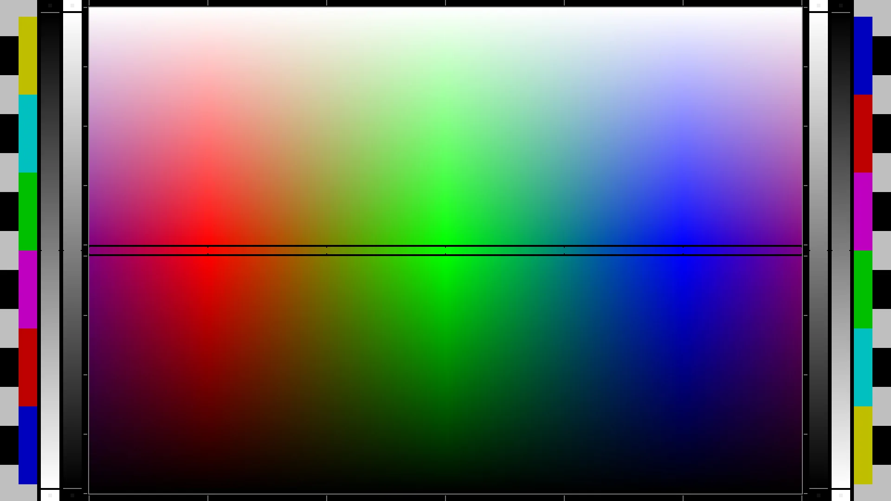
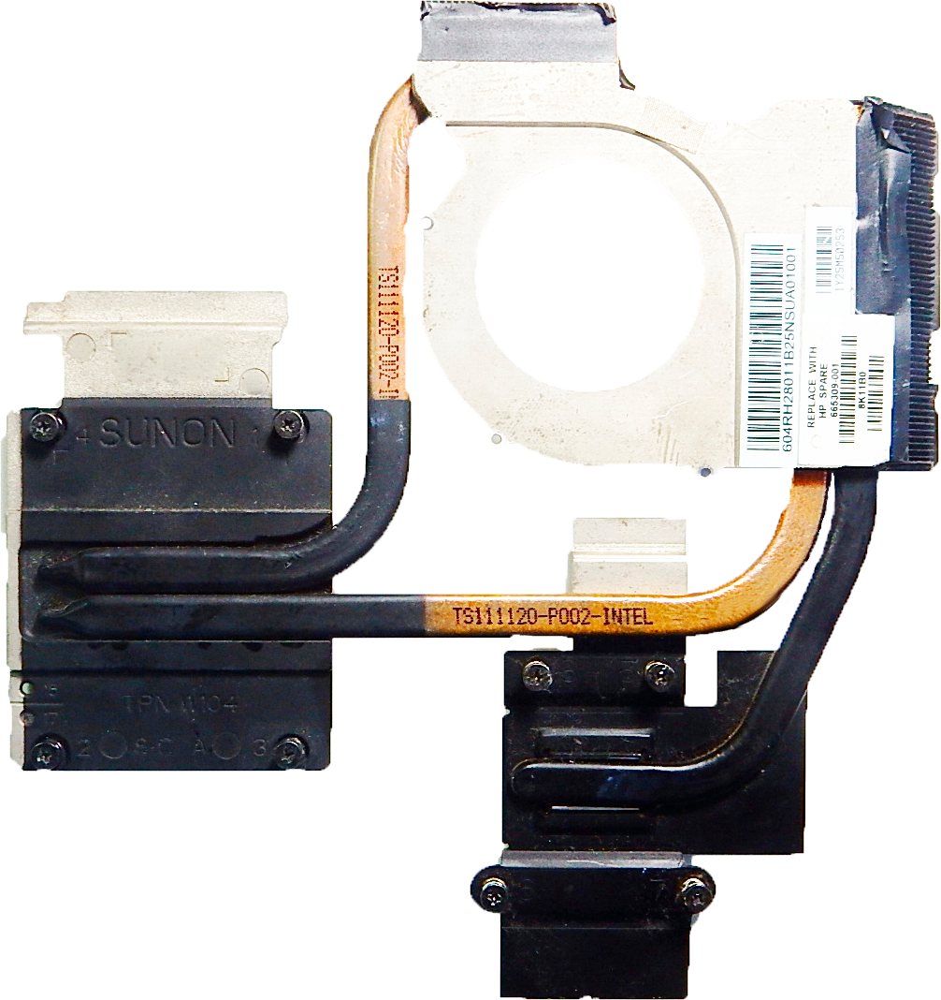

[{align=left width="192"}](HP-Pavilion-dv6.md)

Модельный ряд ноутбуков HP Pavilion dv6 был выпущен в 2009 году и представлял собой мультимедийные устройства для домашнего использования и развлечений. Его стоимость варьировалась в зависимости от конфигурации, но в среднем составляла около 800-1000 долларов (По старому курсу, +-30-40 тысяч рублей). Ноутбук имел стильный по тем меркам дизайн с орнаментами, 15,6-дюймовый HD дисплей, процессор AMD или Intel, видеокарту ATI или AMD Radeon, множество портов и модулей (Сканер отпечатка пальца, встроенный сабвуфер и т.д.). И являясь обладателем этого ноутбука более 10 лет, я не мог не написать про него статью, уж слишком большое влияние он оказал на мою жизнь, мои взгляды на некоторые вещи, моё мировоззрение и мои увлечения. Что ж, нас ожидает весьма длинное чтиво, заваривайте чай и мы начинаем!

<!-- more -->

## История приобретения
[{align=right width="256"}](image.png)
На дворе был то ли 2010, то ли 2011 а может даже 2012 год, точно уже не вспомню. Я был тогда совсем мелкий, лет 5-6 от силы. Дело было вечером, мама возвращается с работы с довольно большой и тяжёлой коробкой в чёрной расцветке и куче надписях на тогда ещё непонятном мне английском языке, как чуть позже оказалось, в этой коробке оказался тот самый нотубук о котором и пойдёт речь в данной статье - **HP Pavilion dv6** ревизии **6c51er**.

Распаковки, как впрочем и первого включения я не помню, помню лишь то что после настройки родительского контроля и пары программ, мне открыли непонятную на то время фиговину, которой являлась Magic Desktop, какой конкретно версии не назову, но выглядела она точь в точь как на изображении сбоку *(Практически все картинки в этой статье кликабельны, и эта картинка не исключение!)*.
## Характеристики
Что-ж, думаю стоит начать повествование с характеристик этого зверя из далёкого прошлого.

!!! info "Сбоку на картинке изображён чуть более продвинутый собрат моего аппарата - HP Pavilion dv6 6c03er"
[{align=right width="300"}](image-2.png)

|      Компонент      |                                                                           Модель                                                                            |
| :-----------------: | :---------------------------------------------------------------------------------------------------------------------------------------------------------: |
|    **Процессор**    | [Intel Core i5-2450M 2.5 GHz (2C4T)](https://ark.intel.com/content/www/us/en/ark/products/53452/intel-core-i5-2450m-processor-3m-cache-up-to-3-10-ghz.html) |
|     **Графика**     |   Intel HD Graphics 3000 + [AMD Radeon™ HD 7470M*](https://www.amd.com/en/support/graphics/amd-radeon-hd/amd-radeon-hd-7000m-series/amd-radeon-hd-7470m)    |
|       **ОЗУ**       |                                                               4Gb DDR3 Elpida (Одной плашкой)                                                               |
|     **Чипсет**      |                       [Intel HM65](https://ark.intel.com/content/www/us/en/ark/products/52808/mobile-intel-hm65-express-chipset.html)                       |
|    **Хранилище**    |                                                                  500GB 5400RPM Toshiba HDD                                                                  |
| **Адаптер питания** |                                                              AC Adapter Series PPP012L-E [90W]                                                              |
|      **Экран**      |                                                    15.6" 1366x768 глянцевая TFT-TN матрица "N156B6-L0B"                                                     |
|     **CD-ROM**      |                                                                     Пишущий CD/DVD-ROM**                                                                     |
|   **Аккумулятор**   |                                                          ???, 6 банок Samsung, +-5-6 часов работы**                                                          |
|      **Сеть**      |                                            *Realtek RTL8168/8111*                                             |
|      **Связь**      |                                            Wi-Fi 4 Qualcomm Atheros AR9485 + Bluetooth 4.? Qualcomm Atheros ???                                             |

*`*Отвал видеочипа из-за перегрева, типовая неисправность для этой модели`* 
*`**Нет точной информации. Аккумулятор умер очень давно как и DVD-ROM и были утилизированны или разобраны на радиодетали.`*

## Порты
Портов в ноутбуке довольно много по сравнению с большинством современных аппаратов. Все перечисленные порты полноразмерные, никаких MicroHDMI или компактных эзернетов. Спереди расположен разъём для SD карт, сзади ничего кроме аккумулятора. Строение корпуса по бокам:

|         Слева         |            Справа             |
| :-------------------: | :---------------------------: |
|    Решётка кулера     | Разъём питания HP 19V игловой |
|          VGA          |       Замок Kensington        |
|         HDMI          |            USB 2.0            |
|       Ethernet        |            USB 2.0            |
|        USB 2.0        |            CD-ROM             |
|        USB 2.0        |                               |
|   Микрофонный вход    |                               |
| Выход для наушников 1 |                               |
| Выход для наушников 2 |                               |

Немного удивляет наличие двух выходов для наушников, практически нигде такого не видел, но довольно полезная фича. Вроде бы, к сожалению, нельзя сделать раздельный вывод на 1 и 2 порт, по идее они запараллелены. Так же современных пользователей может шокировать наличие VGA в ноутбуке, и, возможно, совсем юнных пользователей шокирует существовани CD-ROM'а, хотя в то время он ещё имел какую-ни какую но актуальность (Лично устанавливал игры с дисков которые покупали родители на рынке) 

Так же в более новой ревизии фото которой есть чуть выше, можно заметить передние динамики (Причём все динамики в той ревизии были от Beats Audio, хз куда они пропали, но *хайпили* они не хуже в своё время JBL с колонками). Ещё в более богатой ревизии был сканер отпечатка пальца и ещё какие-то приколы, но у меня этой ревизии не было, так что довольствуемся тем что есть.

## BIOS
=== "InsydeH20 BIOS"
    <figure markdown>
    [{width=512}](image-3.png)
    <figcaption>InsydeH20 BIOS</figcaption>
    </figure>
=== "Advanced tab"
    <figure markdown>
    [{width=512}](image-4.png)
    <figcaption>Advanced tab</figcaption>
    </figure>
=== "Power tabS"
    <figure markdown>
    [{width=512}](image-5.png)
    <figcaption>Power tab</figcaption>
    </figure>

В данной модели установлен **`InsydeH2O BIOS`**. Ооо даа, та самая попа-боль всех владельцев бюджетных аппаратов от HP - **КАСТРИРОВАННЫЙ BIOS**.

Увы, эту модель данная болячка *(Хотя это даже и не болячка, т.к. сделано это преднамеренно)* так же не обошла стороной, но конкретно в моей ревизии ноутбука повезло - в так называемый **`Advanced BIOS`** можно попасть нажимая клавишу **`A`** во время входа в **`BIOS`**.

На удивление, во вкладке **Advanced** офигеть как много настроек, можно настроить практически всё (В т.ч. числе и выделение памяти для встроенной графики а так же выбор используемого выдеовыхода (LVDS/eDP/CRT/и ещё что-то), что даёт довольно интересный потенциал для моддинга). Но, увы, не все компоненты подписаны и имеют внятное описание. Не знаю как вам, но лично мне **`CHAP DEVICE*`** и **`DEVICE 4`** ни о чём не говорят вообще.

<!--*Как оказалось, *[**CHAP DEVICE (Challenge Handshake Authentication Protocol)**](https://ru.wikipedia.org/wiki/CHAP) * — это протокол аутентификации с косвенным согласованием. Является алгоритмом проверки подлинности и предусматривает передачу не самого пароля пользователя, а косвенных сведений о нём.*-->

### Whitelist Wi-Fi адаптеров
!!! warning "Раздел незавершён из-за недостатка информации и/или отсутствия опыта работы с данной темой."

HP не были бы HP если бы не впихнули сюда список *официално поддерживаемых* Wi-Fi адаптеров, всё таки вроде как именно они одни из первых начали везде пихать вайт-листы, а остальные компании это подхватили.

К сожалению мне не приходилось менять Wi-Fi адаптер на этом ноутбуке, но чисто из интереса вставив другой похожий адаптер ноутбук выпал в ошибку не желая даже загружаться :confused:

Если у вас есть какая-то информация или опыт по отвязке вайт-листа от данного аппарата, напишите мне что бы я дополнил статью - [Мои контакты](../../../contacts/index.md).

### Подключение EGPU!? :flushed:
!!! warning "Раздел незавершён, требуется доработка материала."
!!! info "Всё написанное ниже работало у автора статьи, не факт что внешняя видеокарта запустится на конкретно ***вашей*** модели ноутбука. *Автор не несёт ответственности за потраченные вникуда деньги, убитые нервы а так же повреждённое оборудование.*"
Да-да и ещё раз - **да**! Вы не ошиблись при чтении названия этого подраздела, я реально смог завести внешнюю видеокарту на этом аппарате! Честно, ни я, ни кто из моих знакомых тоже не верили что внешняя видеокарта вообще даст картинку на этом аппарате, т.к. это пытались повторить люди на довольно дорогих аппаратах, на старых аппаратах, и даже на тех которые были у блогеров в видео с EGPU. Где-то надо было прошивать модифицированную или старую версию BIOS, где-то EPGU нельзя было запустить никак. Совсем.

Но вернёмся к нашим баранам. 

## Экран
!!! warning "Раздел незавершён, требуется доработка материала."

### Тесты родной матрицы (Углы обзора и цветопередача)

<figure markdown>
[{width=600}](rgb-spectrum.png)
<figcaption>Проверять экран будем с помощью этой картинки</figcaption>
</figure>

*Да, смотреть на экран через другой экран так себе идея, но имеем что имеем.*

=== "60% яркости вид спереди"
    <figure markdown>
    [{width="600"}](image-6.png)
    <figcaption>60% яркости вид спереди</figcaption>
    </figure>

=== "100% яркости вид спереди"
    <figure markdown>
    [{width="600"}](image-7.png)
    <figcaption>100% яркости вид спереди</figcaption>
    </figure>

=== "100% Яркости вид слева"
    <figure markdown>
    [{width="450"}](image-8.png)
    <figcaption>100% Яркости вид слева</figcaption>
    </figure>

=== "100% яркости вид снизу"
    <figure markdown>
    [{width="800"}](image-10.png)
    <figcaption>100% яркости вид снизу</figcaption>
    </figure>
    
=== "100% яркости вид сверху"
    <figure markdown>
    [{width="1000"}](image-9.png)
    <figcaption>100% яркости вид сверху</figcaption>
    </figure>
    
=== "100% яркости вид справа"
    <figure markdown>
    [{width="300"}](image-11.png)
    <figcaption>100% яркости вид справа</figcaption>
    </figure>
    
=== "Полная развёртка экрана"
    <figure markdown>
    [{width="600"}](image-12.png)
    <figcaption>Полная развёртка экрана</figcaption>
    </figure>

Сказать что качество экрана **ужасное** - ничего не сказать. После хорошего IPS монитора смотреть на *это* больно глазам. Всё это потому что это TFT-TN матрица очень старой модели, те кто работал за современными TN+Film прокачанными мониторами, не поверят что эта матрица ноутбука и матрица в их мониторе являются собратьями. Но про качественные TN матрицы в мониторах когда ни будь в другой раз.

### Замена матрицы на IPS

У кого-то мог возникнуть резонный вопрос. Что с этим делать? У меня он тоже возникал, причём очень давно. И ответ: **Ничего**.
Идея купить IPS матрицу вместо TN'ки идёт по жопе по причине того, что найти в продаже обычную, **не ultra-slim IPS** матрицу с **`6bit 1 channel LVDS 40 pin`** и разрешением **1366x768** - очень проблематично.

!!! info "Так же надо упомянуть довольно высокие цены на эти матрицы, [**`LP156WHA-SLA2`**](https://www.panelook.com/LP156WHA-SLA2_LG%20Display_15.6_LCM_overview_19197.html) на AliExpress на момент написания статьи стоит от 6 до 10 тысяч рублей."

Мне всё таки удалось найти две максимально подходящие IPS матрицы по практически всем параметрам. Единственное различие в размерах по паре миллиметров, не думаю что это критично. Если кто-то захочет попробовать поменять матрицу на этом аппарате, вот две матрицы от LG похожие на оригинальную: [LP156WHA-SLL1](https://www.panelook.com/LP156WHA-SLL1_LG%20Display_15.6_LCM_overview_19710.html) и [LP156WHA-SLA2](https://www.panelook.com/LP156WHA-SLA2_LG%20Display_15.6_LCM_overview_19197.html).
*P.S. Напишите мне о результате проделанной работе, очень интересно посмотреть как будет выглядеть ноутбук с такой матрицей, если всё будет шикарно, быть может и я постараюсь найти в продаже одну из этих матриц. [Мои контакты](../../../contacts/index.md)*

### Установка EDP матрицы?..

!!! warning "Возможность распайки коннектора EDP, его обвязки и установка EDP матрицы не известна. В BIOS так же есть пукт с выбором матрицы - LVDS, CRT *(Скорее всего VGA)* и eDP. Несмотря на то, что у меня есть и разъём EDP и FullHD EDP матрица, пускай и 13", я не рискнул проводить такие эксперименты.  Если у вас есть какая-то информация по этому поводу - свяжитесь со мной."

=== "Нераспаянный коннектор на HP Pavilion dv6"

    <figure markdown>
    
    <figcaption>Нераспаянный коннектор 30 Pin EDP и его обвязка на материнской плате ноутбука рядом с кулером</figcaption>
    </figure>

=== "Распаянный коннектор на Prestigio SmartBook 133S"

    <figure markdown>
    
    <figcaption>Распаянный коннектор 30 Pin EDP и его обвязка на материнской плате другого ноутбука (Prestigio SmartBook 133S)</figcaption>
    </figure>

## Материнская плата
!!! warning "Раздел незавершён, требуется доработка материала."

### Фотографии
=== "Фото 1 (Низкое качество)"
    <figure markdown>
    [{align=right width=400}](mb1.png)
    <figcaption>Фото материнской платы 1</figcaption>
    </figure>

=== "Фото 2 (Среднее качество)"
    <figure markdown>
    [{align=right width=800}](mb2.png)
    <figcaption>Фото материнской платы 2</figcaption>
    </figure>

!!! info "У меня нет возможности сделать скан-версию материнской платы т.к. у меня нет сканера. Если у вас есть скан-версия материнской платы или вы хотите материально меня поддержать, напишите мне - [Мои контакты](../../../contacts/index.md)"

## Температуры, охлаждение и тротлинг
<figure markdown>
{width=400}
</figure>

### TDP
- В ноутбуке установлен процессор [Intel Core i5-2450M 2.5 GHz](https://ark.intel.com/content/www/us/en/ark/products/53452/intel-core-i5-2450m-processor-3m-cache-up-to-3-10-ghz.html) с теплопакетом в **35 Ватт**.
- Так же в ноутбуке установлена дискретная графика [AMD Radeon™ HD 7470M](https://www.amd.com/en/support/graphics/amd-radeon-hd/amd-radeon-hd-7000m-series/amd-radeon-hd-7470m) с теплопакетом в **25 Ватт** *([Информация взята с этого сайта](https://www.techpowerup.com/gpu-specs/radeon-hd-7470m.c370))*.
- Чипсет в ноутбуке установлен [Intel HM65](https://ark.intel.com/content/www/us/en/ark/products/52808/mobile-intel-hm65-express-chipset.html) с TDP в **4 Ватта**, охлаждается он отдельно маленькой алюминиевой пластинкой, поэтому сильно на охлаждение не влияет.

Если пренебречь нагревом всех остальных компонентов (В том числе VRM, видеопамяти, оперативной памяти, Wi-Fi модуля и даже жёсткого диска) TDP процессора и видеокарты получается 60 ватт, что довольно много для столь небольшой системы охлаждения.

### Система охлаждения
#### Фото
<figure markdown>
[{width=400}](hp-pavilion-dv6-6000-cooling-system.png)
<figcaption>Система охлаждения ноутбука</figcaption>
</figure>

#### Описание и проблемы
Забегая на перёд, т.к. видеокарта в моём аппарате не выдержала такой адской жары она решила покончить с собой принеся в мою жизнь головную боль пока я наконец-то не отпаял дроссель питания дискретной графики. Но даже это не помогло охлаждению, нагрев стал чуть меньше, но С.О. банально не успевает отводить тепло от процессора, неизвестно почему. Термопаста намазана новая, дорогая, MX-5, пробовал так же GD-900 и относительно дешёвую Aerocool Baraf-S, изменений никаких. При запуске стресс-теста процессор мгновенно нагревается до 90 градусов, С.О. явно неисправна, возможно за столь долгое время в теплотрубках что-то произошло с жидкостью внутри *(Обычно это или дистилированная вода или спирт, но слышал что очень старые С.О. заправляли фреоном, но возможно это байка)*, хотя теплотрубки идеально целые, не гнутные, ну да ладно.

Система охлаждения ноутбука довольно примитивная, одна турбина, три теплотрубки, причём с довольно интересным расположением: Две теплотрубки идут на процессор, но одна идёт на маленькую решётку радиатора (Находится с задней стороны корпуса), а другая идёт на широкую решётку радиатора (Находится с левой стороны корпуса), так же на широкую решётку идёт теплотрубка от видеочипа. Так же через термопрокладки охлаждается и VRM питания процессора. Видеопамять находится с обратной стороны и не охлаждается.

=== "Фото 1 (Обрезанный оригинал)"
    <figure markdown>
    [{width=300}](vram.png)
    <figcaption>Чипы памяти на обратной стороне платы, под клавиатурой</figcaption>
    </figure>

=== "Фото 2 (Апскейл с помощью нейросети)"
    <figure markdown>
    [{width=600}](vram-gigapixel-low_res-scale-2_00x.png)
    <figcaption>Чипы памяти на обратной стороне платы, под клавиатурой</figcaption>
    </figure>

## Превращение в Hackintosh (Установка MacOS High Sierra) :flushed:
[{align=right width="384"}](hacos/photo_2024-04-01_22-52-31.jpg)
Вы думали это всё? Да как бы ни так. Я решил упороться с этим ноутом по полной и вспомнил что на платформе Sandy Bridge когда-то выходила серия MacBook Pro 2011 года, а значит, на этого монстра тоже можно *вкостылить* (Именно что вкостылить, это ж Legacy, так ещё и от HP...) самую настоящую MacOS!  
Почему мой выбор пал на столь старую версию системы? MacOS 10.13 (High Sierra) ведь не поддерживается уже целой кучей софта, скажите вы, и будете чертовски правы! Фуррифокс *(firefox)* и телеграм последней версии у меня установить получилось, а вот дискорд попросил уже MacOS 10.15...
[{align=right width="256"}](hacos/photo_2024-03-28_23-01-40.jpg)
Так вот, связан столь странный выбор ОС с тем, что Sandy Bridge прекрасно поддерживает даже последнюю на момент написания статьи Mac OS 14 (Sonoma), а вот встроенная Intel HD Graphics 3000 поддерживается максимум MacOS 10.13 (High Sierra). Печально, но факт. Если бы у меня была другая видяха, хотя бы Gt710, то подключив её по [eGPU](#egpu) я смог бы запустить более современную систему, но увы, в коллекции у меня только Gt210 и RTX 3060 в моём ПК. 
В общем, было решено не морочить себе голову и ставить то что есть. По итогу провозились мы втроём 3 дня, и кое как завели эту шайтан машину дьявола. Проблемы возникли там, где их совсем не ждали, если честно. 
В общем, вот список всего что мне удалось завести, а что так и не заработало даже после бессоных ночей ковыряния кекстов и патчей:

|         Завелось         |            Не завелось             |
| :-------------------: | :---------------------------: |
| PS/2 встроенная клавиатура (Целый день её заводили, и таки завели!) | **`PS/2 Synaptic TouchPad`** (Завёлся, но очень криво и плохо...) |
| Intel HD Graphics 3000 (Есть баги с фреймбуффером, акселлерацией и 3D приложениями, но оно всё же скорее работает чем не работает) | Wi-Fi/Bt модуль. (Atheros вроде никогда не ставился в устройства Apple, по крайней мере, кекстов под мою сетевуху я не нашёл, зато нашёл под Broadcom которая у меня есть, но не работает потому что #HPмомент с вайтлистом в BIOS...) |
| Кодек **`IDT 92HD81B1X`** (Пришлось ставить устаревший аудиодрайвер VoodooHDA) | USB. (Вообще никак. Ни один порт. Ни с помощью USBinjectAll, ни с помощью маппинга портов, ни с помощью патча HPET.) |
| Подсветка матрицы |  |
| Сеть Realtek 8111 |  |

Остальное уже по мелочи, но либо отсутсвует в ноутбуке *(Press F to вебка и микрофоны)*, либо работает.

## Драйверы и утилиты
!!! info "**Все драйверы и утилиты скачаны с официального сайта HP**"
!!! warning "**Скачанные драйверы и утилиты предназначены для Windows 7, но большинство вполне работает и на Windows 10.**"
### Драйверы

=== "Аудио драйвер"
    

        [**`IDT High Definition (HD) Audio Driver`**](<https://ibifs.ddns.net/%D0%9F%D1%80%D0%BE%D0%B3%D1%80%D0%B0%D0%BC%D0%BC%D1%8B/%D0%94%D1%80%D0%B0%D0%B9%D0%B2%D0%B5%D1%80%D0%B0%20%D0%B8%20%D0%BA%D0%BE%D0%BC%D0%BF%D0%BE%D0%BD%D0%B5%D0%BD%D1%82%D1%8B/HP%20Pavilion%20dv6%206c51er/drivers-tools/IDT High Definition (HD) Audio Driver.exe>)
    

    

        [**`Conexant USB Audio Driver`**](<https://ibifs.ddns.net/%D0%9F%D1%80%D0%BE%D0%B3%D1%80%D0%B0%D0%BC%D0%BC%D1%8B/%D0%94%D1%80%D0%B0%D0%B9%D0%B2%D0%B5%D1%80%D0%B0%20%D0%B8%20%D0%BA%D0%BE%D0%BC%D0%BF%D0%BE%D0%BD%D0%B5%D0%BD%D1%82%D1%8B/HP%20Pavilion%20dv6%206c51er/drivers-tools/Conexant USB Audio Driver.exe>)
    

=== "Драйвер чипсета"
    

        [**`Intel Management Engine Interface (MEI) Driver`**](<https://ibifs.ddns.net/%D0%9F%D1%80%D0%BE%D0%B3%D1%80%D0%B0%D0%BC%D0%BC%D1%8B/%D0%94%D1%80%D0%B0%D0%B9%D0%B2%D0%B5%D1%80%D0%B0%20%D0%B8%20%D0%BA%D0%BE%D0%BC%D0%BF%D0%BE%D0%BD%D0%B5%D0%BD%D1%82%D1%8B/HP%20Pavilion%20dv6%206c51er/drivers-tools/Intel Management Engine Interface (MEI) Driver.exe>)
    

    

        [**`Intel Chipset Installation Utility and Driver`**](<https://ibifs.ddns.net/%D0%9F%D1%80%D0%BE%D0%B3%D1%80%D0%B0%D0%BC%D0%BC%D1%8B/%D0%94%D1%80%D0%B0%D0%B9%D0%B2%D0%B5%D1%80%D0%B0%20%D0%B8%20%D0%BA%D0%BE%D0%BC%D0%BF%D0%BE%D0%BD%D0%B5%D0%BD%D1%82%D1%8B/HP%20Pavilion%20dv6%206c51er/drivers-tools/Intel Chipset Installation Utility and Driver.exe>)
    

=== "Графический драйвер"
    

        [**`AMD High-Definition Graphics Driver`**](<https://ibifs.ddns.net/%D0%9F%D1%80%D0%BE%D0%B3%D1%80%D0%B0%D0%BC%D0%BC%D1%8B/%D0%94%D1%80%D0%B0%D0%B9%D0%B2%D0%B5%D1%80%D0%B0%20%D0%B8%20%D0%BA%D0%BE%D0%BC%D0%BF%D0%BE%D0%BD%D0%B5%D0%BD%D1%82%D1%8B/HP%20Pavilion%20dv6%206c51er/drivers-tools/AMD High-Definition Graphics Driver.exe>)
    

    

        [**`AMD/Intel Switchable High-Definition (HD) Graphics Driver`**](<https://ibifs.ddns.net/%D0%9F%D1%80%D0%BE%D0%B3%D1%80%D0%B0%D0%BC%D0%BC%D1%8B/%D0%94%D1%80%D0%B0%D0%B9%D0%B2%D0%B5%D1%80%D0%B0%20%D0%B8%20%D0%BA%D0%BE%D0%BC%D0%BF%D0%BE%D0%BD%D0%B5%D0%BD%D1%82%D1%8B/HP%20Pavilion%20dv6%206c51er/drivers-tools/AMD_Intel Switchable High-Definition (HD) Graphics Driver.exe>)
    

=== "Драйверы устройств ввода"
    

        [**`Validity Fingerprint Sensor Driver`**](<https://ibifs.ddns.net/%D0%9F%D1%80%D0%BE%D0%B3%D1%80%D0%B0%D0%BC%D0%BC%D1%8B/%D0%94%D1%80%D0%B0%D0%B9%D0%B2%D0%B5%D1%80%D0%B0%20%D0%B8%20%D0%BA%D0%BE%D0%BC%D0%BF%D0%BE%D0%BD%D0%B5%D0%BD%D1%82%D1%8B/HP%20Pavilion%20dv6%206c51er/drivers-tools/Validity Fingerprint Sensor Driver.exe>)
    

    

        [**`Synaptics TouchPad Driver`**](<https://ibifs.ddns.net/%D0%9F%D1%80%D0%BE%D0%B3%D1%80%D0%B0%D0%BC%D0%BC%D1%8B/%D0%94%D1%80%D0%B0%D0%B9%D0%B2%D0%B5%D1%80%D0%B0%20%D0%B8%20%D0%BA%D0%BE%D0%BC%D0%BF%D0%BE%D0%BD%D0%B5%D0%BD%D1%82%D1%8B/HP%20Pavilion%20dv6%206c51er/drivers-tools/Synaptics TouchPad Driver.exe>)
    

    

        [**`Fresco Logic USB 3.0 Host Controller Driver`**](<https://ibifs.ddns.net/%D0%9F%D1%80%D0%BE%D0%B3%D1%80%D0%B0%D0%BC%D0%BC%D1%8B/%D0%94%D1%80%D0%B0%D0%B9%D0%B2%D0%B5%D1%80%D0%B0%20%D0%B8%20%D0%BA%D0%BE%D0%BC%D0%BF%D0%BE%D0%BD%D0%B5%D0%BD%D1%82%D1%8B/HP%20Pavilion%20dv6%206c51er/drivers-tools/Fresco Logic USB 3.0 Host Controller Driver.exe>)
    

    

        [**`Renesas Electronics USB 3.0 Host Controller Driver`**](<https://ibifs.ddns.net/%D0%9F%D1%80%D0%BE%D0%B3%D1%80%D0%B0%D0%BC%D0%BC%D1%8B/%D0%94%D1%80%D0%B0%D0%B9%D0%B2%D0%B5%D1%80%D0%B0%20%D0%B8%20%D0%BA%D0%BE%D0%BC%D0%BF%D0%BE%D0%BD%D0%B5%D0%BD%D1%82%D1%8B/HP%20Pavilion%20dv6%206c51er/drivers-tools/Renesas Electronics USB 3.0 Host Controller Driver.exe>)
    

=== "Сетевые драйвера"
    

        [**`Broadcom Wireless LAN Driver`**](<https://ibifs.ddns.net/%D0%9F%D1%80%D0%BE%D0%B3%D1%80%D0%B0%D0%BC%D0%BC%D1%8B/%D0%94%D1%80%D0%B0%D0%B9%D0%B2%D0%B5%D1%80%D0%B0%20%D0%B8%20%D0%BA%D0%BE%D0%BC%D0%BF%D0%BE%D0%BD%D0%B5%D0%BD%D1%82%D1%8B/HP%20Pavilion%20dv6%206c51er/drivers-tools/Broadcom Wireless LAN Driver.exe>)
    

    

        [**`Intel Wireless Drivers, Intel PROSet, and Intel My WiFi for Microsoft Windows 7`**](<https://ibifs.ddns.net/%D0%9F%D1%80%D0%BE%D0%B3%D1%80%D0%B0%D0%BC%D0%BC%D1%8B/%D0%94%D1%80%D0%B0%D0%B9%D0%B2%D0%B5%D1%80%D0%B0%20%D0%B8%20%D0%BA%D0%BE%D0%BC%D0%BF%D0%BE%D0%BD%D0%B5%D0%BD%D1%82%D1%8B/HP%20Pavilion%20dv6%206c51er/drivers-tools/Intel Wireless Drivers, Intel PROSet, and Intel My WiFi for Microsoft Windows 7.exe>)
    

    

        [**`Ralink 802.11 b/g/n WiFi Adapter`**](<https://ibifs.ddns.net/%D0%9F%D1%80%D0%BE%D0%B3%D1%80%D0%B0%D0%BC%D0%BC%D1%8B/%D0%94%D1%80%D0%B0%D0%B9%D0%B2%D0%B5%D1%80%D0%B0%20%D0%B8%20%D0%BA%D0%BE%D0%BC%D0%BF%D0%BE%D0%BD%D0%B5%D0%BD%D1%82%D1%8B/HP%20Pavilion%20dv6%206c51er/drivers-tools/Ralink 802.11 bgn WiFi Adapter.exe>)
    

    

        [**`Realtek Local Area Network (LAN) Driver`**](<https://ibifs.ddns.net/%D0%9F%D1%80%D0%BE%D0%B3%D1%80%D0%B0%D0%BC%D0%BC%D1%8B/%D0%94%D1%80%D0%B0%D0%B9%D0%B2%D0%B5%D1%80%D0%B0%20%D0%B8%20%D0%BA%D0%BE%D0%BC%D0%BF%D0%BE%D0%BD%D0%B5%D0%BD%D1%82%D1%8B/HP%20Pavilion%20dv6%206c51er/drivers-tools/Realtek Local Area Network (LAN) Driver.exe>)
    

    

        [**`Ralink/Motorola Bluetooth Adapter Driver`**](<https://ibifs.ddns.net/%D0%9F%D1%80%D0%BE%D0%B3%D1%80%D0%B0%D0%BC%D0%BC%D1%8B/%D0%94%D1%80%D0%B0%D0%B9%D0%B2%D0%B5%D1%80%D0%B0%20%D0%B8%20%D0%BA%D0%BE%D0%BC%D0%BF%D0%BE%D0%BD%D0%B5%D0%BD%D1%82%D1%8B/HP%20Pavilion%20dv6%206c51er/drivers-tools/Ralink Motorola Bluetooth Adapter Driver.exe>)
    

    

        [**`Atheros Bluetooth Driver`**](<https://ibifs.ddns.net/%D0%9F%D1%80%D0%BE%D0%B3%D1%80%D0%B0%D0%BC%D0%BC%D1%8B/%D0%94%D1%80%D0%B0%D0%B9%D0%B2%D0%B5%D1%80%D0%B0%20%D0%B8%20%D0%BA%D0%BE%D0%BC%D0%BF%D0%BE%D0%BD%D0%B5%D0%BD%D1%82%D1%8B/HP%20Pavilion%20dv6%206c51er/drivers-tools/Atheros Bluetooth Driver.exe>)
    

    

        [**`Intel PROSet Bluetooth Driver`**](<https://ibifs.ddns.net/%D0%9F%D1%80%D0%BE%D0%B3%D1%80%D0%B0%D0%BC%D0%BC%D1%8B/%D0%94%D1%80%D0%B0%D0%B9%D0%B2%D0%B5%D1%80%D0%B0%20%D0%B8%20%D0%BA%D0%BE%D0%BC%D0%BF%D0%BE%D0%BD%D0%B5%D0%BD%D1%82%D1%8B/HP%20Pavilion%20dv6%206c51er/drivers-tools/Intel PROSet Bluetooth Driver.exe>)
    

    

        [**`Intel Wireless Drivers for Microsoft Windows 7`**](<https://ibifs.ddns.net/%D0%9F%D1%80%D0%BE%D0%B3%D1%80%D0%B0%D0%BC%D0%BC%D1%8B/%D0%94%D1%80%D0%B0%D0%B9%D0%B2%D0%B5%D1%80%D0%B0%20%D0%B8%20%D0%BA%D0%BE%D0%BC%D0%BF%D0%BE%D0%BD%D0%B5%D0%BD%D1%82%D1%8B/HP%20Pavilion%20dv6%206c51er/drivers-tools/Intel Wireless Drivers for Microsoft Windows 7.exe>)
    

    

        [**`Atheros 2011 Wireless LAN Driver`**](<https://ibifs.ddns.net/%D0%9F%D1%80%D0%BE%D0%B3%D1%80%D0%B0%D0%BC%D0%BC%D1%8B/%D0%94%D1%80%D0%B0%D0%B9%D0%B2%D0%B5%D1%80%D0%B0%20%D0%B8%20%D0%BA%D0%BE%D0%BC%D0%BF%D0%BE%D0%BD%D0%B5%D0%BD%D1%82%D1%8B/HP%20Pavilion%20dv6%206c51er/drivers-tools/Atheros 2011 Wireless LAN Driver.exe>)
    

=== "Драйвера накопителей"
    

        [**`Realtek Card Reader Driver`**](<https://ibifs.ddns.net/%D0%9F%D1%80%D0%BE%D0%B3%D1%80%D0%B0%D0%BC%D0%BC%D1%8B/%D0%94%D1%80%D0%B0%D0%B9%D0%B2%D0%B5%D1%80%D0%B0%20%D0%B8%20%D0%BA%D0%BE%D0%BC%D0%BF%D0%BE%D0%BD%D0%B5%D0%BD%D1%82%D1%8B/HP%20Pavilion%20dv6%206c51er/drivers-tools/Realtek Card Reader Driver.exe>)
    

    

        [**`Intel Rapid Storage Technology Driver`**](<https://ibifs.ddns.net/%D0%9F%D1%80%D0%BE%D0%B3%D1%80%D0%B0%D0%BC%D0%BC%D1%8B/%D0%94%D1%80%D0%B0%D0%B9%D0%B2%D0%B5%D1%80%D0%B0%20%D0%B8%20%D0%BA%D0%BE%D0%BC%D0%BF%D0%BE%D0%BD%D0%B5%D0%BD%D1%82%D1%8B/HP%20Pavilion%20dv6%206c51er/drivers-tools/Intel Rapid Storage Technology Driver.exe>)
    

=== "ПО"
    

        [**`HP Recovery Manager Application`**](<https://ibifs.ddns.net/%D0%9F%D1%80%D0%BE%D0%B3%D1%80%D0%B0%D0%BC%D0%BC%D1%8B/%D0%94%D1%80%D0%B0%D0%B9%D0%B2%D0%B5%D1%80%D0%B0%20%D0%B8%20%D0%BA%D0%BE%D0%BC%D0%BF%D0%BE%D0%BD%D0%B5%D0%BD%D1%82%D1%8B/HP%20Pavilion%20dv6%206c51er/drivers-tools/HP Recovery Manager Application.exe>)
    

=== "Мультимедийное ПО"
    

        [**`Cyberlink YouCam Software`**](<https://ibifs.ddns.net/%D0%9F%D1%80%D0%BE%D0%B3%D1%80%D0%B0%D0%BC%D0%BC%D1%8B/%D0%94%D1%80%D0%B0%D0%B9%D0%B2%D0%B5%D1%80%D0%B0%20%D0%B8%20%D0%BA%D0%BE%D0%BC%D0%BF%D0%BE%D0%BD%D0%B5%D0%BD%D1%82%D1%8B/HP%20Pavilion%20dv6%206c51er/drivers-tools/Cyberlink YouCam Software.exe>)
    

    

        [**`CyberLink PowerDVD 10 (2D/3D)`**](<https://ibifs.ddns.net/%D0%9F%D1%80%D0%BE%D0%B3%D1%80%D0%B0%D0%BC%D0%BC%D1%8B/%D0%94%D1%80%D0%B0%D0%B9%D0%B2%D0%B5%D1%80%D0%B0%20%D0%B8%20%D0%BA%D0%BE%D0%BC%D0%BF%D0%BE%D0%BD%D0%B5%D0%BD%D1%82%D1%8B/HP%20Pavilion%20dv6%206c51er/drivers-tools/CyberLink PowerDVD 10 (2D 3D).exe>)
    

    

        [**`Intel Wireless Display Software`**](<https://ibifs.ddns.net/%D0%9F%D1%80%D0%BE%D0%B3%D1%80%D0%B0%D0%BC%D0%BC%D1%8B/%D0%94%D1%80%D0%B0%D0%B9%D0%B2%D0%B5%D1%80%D0%B0%20%D0%B8%20%D0%BA%D0%BE%D0%BC%D0%BF%D0%BE%D0%BD%D0%B5%D0%BD%D1%82%D1%8B/HP%20Pavilion%20dv6%206c51er/drivers-tools/Intel Wireless Display Software.exe>)
    

=== "Защитное ПО"
    

        [**`HP ProtectSmart Hard Drive Protection`**](<https://ibifs.ddns.net/%D0%9F%D1%80%D0%BE%D0%B3%D1%80%D0%B0%D0%BC%D0%BC%D1%8B/%D0%94%D1%80%D0%B0%D0%B9%D0%B2%D0%B5%D1%80%D0%B0%20%D0%B8%20%D0%BA%D0%BE%D0%BC%D0%BF%D0%BE%D0%BD%D0%B5%D0%BD%D1%82%D1%8B/HP%20Pavilion%20dv6%206c51er/drivers-tools/HP ProtectSmart Hard Drive Protection.exe>)
    

    

        [**`Symantec Validation and ID Protection Service (VIP) Access SDK`**](<https://ibifs.ddns.net/%D0%9F%D1%80%D0%BE%D0%B3%D1%80%D0%B0%D0%BC%D0%BC%D1%8B/%D0%94%D1%80%D0%B0%D0%B9%D0%B2%D0%B5%D1%80%D0%B0%20%D0%B8%20%D0%BA%D0%BE%D0%BC%D0%BF%D0%BE%D0%BD%D0%B5%D0%BD%D1%82%D1%8B/HP%20Pavilion%20dv6%206c51er/drivers-tools/Symantec Validation and ID Protection Service (VIP) Access SDK.exe>)
    

    

        [**`HP SimplePass Identity Protection 2011 Software`**](<https://ibifs.ddns.net/%D0%9F%D1%80%D0%BE%D0%B3%D1%80%D0%B0%D0%BC%D0%BC%D1%8B/%D0%94%D1%80%D0%B0%D0%B9%D0%B2%D0%B5%D1%80%D0%B0%20%D0%B8%20%D0%BA%D0%BE%D0%BC%D0%BF%D0%BE%D0%BD%D0%B5%D0%BD%D1%82%D1%8B/HP%20Pavilion%20dv6%206c51er/drivers-tools/HP SimplePass Identity Protection 2011 Software.exe>)
    

=== "Программные решения"
    

        [**`HP CoolSense Technology`**](<https://ibifs.ddns.net/%D0%9F%D1%80%D0%BE%D0%B3%D1%80%D0%B0%D0%BC%D0%BC%D1%8B/%D0%94%D1%80%D0%B0%D0%B9%D0%B2%D0%B5%D1%80%D0%B0%20%D0%B8%20%D0%BA%D0%BE%D0%BC%D0%BF%D0%BE%D0%BD%D0%B5%D0%BD%D1%82%D1%8B/HP%20Pavilion%20dv6%206c51er/drivers-tools/HP CoolSense Technology.exe>)
    

    

        [**`HP Launch Box`**](<https://ibifs.ddns.net/%D0%9F%D1%80%D0%BE%D0%B3%D1%80%D0%B0%D0%BC%D0%BC%D1%8B/%D0%94%D1%80%D0%B0%D0%B9%D0%B2%D0%B5%D1%80%D0%B0%20%D0%B8%20%D0%BA%D0%BE%D0%BC%D0%BF%D0%BE%D0%BD%D0%B5%D0%BD%D1%82%D1%8B/HP%20Pavilion%20dv6%206c51er/drivers-tools/HP Launch Box.exe>)
    

    

        [**`HP Power Manager Utility Software`**](<https://ibifs.ddns.net/%D0%9F%D1%80%D0%BE%D0%B3%D1%80%D0%B0%D0%BC%D0%BC%D1%8B/%D0%94%D1%80%D0%B0%D0%B9%D0%B2%D0%B5%D1%80%D0%B0%20%D0%B8%20%D0%BA%D0%BE%D0%BC%D0%BF%D0%BE%D0%BD%D0%B5%D0%BD%D1%82%D1%8B/HP%20Pavilion%20dv6%206c51er/drivers-tools/HP Power Manager Utility Software.exe>)
    

    

        [**`HP Software Framework`**](<https://ibifs.ddns.net/%D0%9F%D1%80%D0%BE%D0%B3%D1%80%D0%B0%D0%BC%D0%BC%D1%8B/%D0%94%D1%80%D0%B0%D0%B9%D0%B2%D0%B5%D1%80%D0%B0%20%D0%B8%20%D0%BA%D0%BE%D0%BC%D0%BF%D0%BE%D0%BD%D0%B5%D0%BD%D1%82%D1%8B/HP%20Pavilion%20dv6%206c51er/drivers-tools/HP Software Framework.exe>)
    

    

        [**`HP Quick Launch Software`**](<https://ibifs.ddns.net/%D0%9F%D1%80%D0%BE%D0%B3%D1%80%D0%B0%D0%BC%D0%BC%D1%8B/%D0%94%D1%80%D0%B0%D0%B9%D0%B2%D0%B5%D1%80%D0%B0%20%D0%B8%20%D0%BA%D0%BE%D0%BC%D0%BF%D0%BE%D0%BD%D0%B5%D0%BD%D1%82%D1%8B/HP%20Pavilion%20dv6%206c51er/drivers-tools/HP Quick Launch Software.exe>)
    

    

        [**`HP Application Assistant Software`**](<https://ibifs.ddns.net/%D0%9F%D1%80%D0%BE%D0%B3%D1%80%D0%B0%D0%BC%D0%BC%D1%8B/%D0%94%D1%80%D0%B0%D0%B9%D0%B2%D0%B5%D1%80%D0%B0%20%D0%B8%20%D0%BA%D0%BE%D0%BC%D0%BF%D0%BE%D0%BD%D0%B5%D0%BD%D1%82%D1%8B/HP%20Pavilion%20dv6%206c51er/drivers-tools/HP Application Assistant Software.exe>)
    

### Утилиты

=== "BIOS"
    

        [**`HP Notebook System BIOS Update`**](https://ibifs.ddns.net/%D0%9F%D1%80%D0%BE%D0%B3%D1%80%D0%B0%D0%BC%D0%BC%D1%8B/%D0%94%D1%80%D0%B0%D0%B9%D0%B2%D0%B5%D1%80%D0%B0%20%D0%B8%20%D0%BA%D0%BE%D0%BC%D0%BF%D0%BE%D0%BD%D0%B5%D0%BD%D1%82%D1%8B/HP%20Pavilion%20dv6%206c51er/drivers-tools/HP%20Notebook%20System%20BIOS%20Update.exe)
    

=== "Диагностика"
    

        [**`HP UEFI Support Environment`**](https://ibifs.ddns.net/%D0%9F%D1%80%D0%BE%D0%B3%D1%80%D0%B0%D0%BC%D0%BC%D1%8B/%D0%94%D1%80%D0%B0%D0%B9%D0%B2%D0%B5%D1%80%D0%B0%20%D0%B8%20%D0%BA%D0%BE%D0%BC%D0%BF%D0%BE%D0%BD%D0%B5%D0%BD%D1%82%D1%8B/HP%20Pavilion%20dv6%206c51er/drivers-tools/HP%20UEFI%20Support%20Environment.exe)
    

=== "Диагностические утилиты"
    

        [**`HP Unified Extensible Firmware Interface (UEFI) Support Environment`**](<https://ibifs.ddns.net/%D0%9F%D1%80%D0%BE%D0%B3%D1%80%D0%B0%D0%BC%D0%BC%D1%8B/%D0%94%D1%80%D0%B0%D0%B9%D0%B2%D0%B5%D1%80%D0%B0%20%D0%B8%20%D0%BA%D0%BE%D0%BC%D0%BF%D0%BE%D0%BD%D0%B5%D0%BD%D1%82%D1%8B/HP%20Pavilion%20dv6%206c51er/drivers-tools/HP Unified Extensible Firmware Interface (UEFI) Support Environment.exe>)
    

=== "Прошивки (накопителей)"
    

        [**`Seagate Hard Drive Firmware Update (0006HPM1 Rev.A)`**](<https://ibifs.ddns.net/%D0%9F%D1%80%D0%BE%D0%B3%D1%80%D0%B0%D0%BC%D0%BC%D1%8B/%D0%94%D1%80%D0%B0%D0%B9%D0%B2%D0%B5%D1%80%D0%B0%20%D0%B8%20%D0%BA%D0%BE%D0%BC%D0%BF%D0%BE%D0%BD%D0%B5%D0%BD%D1%82%D1%8B/HP%20Pavilion%20dv6%206c51er/drivers-tools/Seagate Hard Drive Firmware Update.exe>)
    

    

        [**`Intel Solid State Drive (SSD) Firmware Update (2CV102M3/2CV102M6/4PC103)`**](<https://ibifs.ddns.net/%D0%9F%D1%80%D0%BE%D0%B3%D1%80%D0%B0%D0%BC%D0%BC%D1%8B/%D0%94%D1%80%D0%B0%D0%B9%D0%B2%D0%B5%D1%80%D0%B0%20%D0%B8%20%D0%BA%D0%BE%D0%BC%D0%BF%D0%BE%D0%BD%D0%B5%D0%BD%D1%82%D1%8B/HP%20Pavilion%20dv6%206c51er/drivers-tools/Intel Solid State Drive (SSD) Firmware Update.exe>)
    

=== "Улучшения операционной системы и QFE"
    

        [**`Essential System Updates`**](<https://ibifs.ddns.net/%D0%9F%D1%80%D0%BE%D0%B3%D1%80%D0%B0%D0%BC%D0%BC%D1%8B/%D0%94%D1%80%D0%B0%D0%B9%D0%B2%D0%B5%D1%80%D0%B0%20%D0%B8%20%D0%BA%D0%BE%D0%BC%D0%BF%D0%BE%D0%BD%D0%B5%D0%BD%D1%82%D1%8B/HP%20Pavilion%20dv6%206c51er/drivers-tools/Essential System Updates.exe>)
    

=== "Инструменты и утилиты"
    

        [**`Vodafone 3G Modem System Update`**](<https://ibifs.ddns.net/%D0%9F%D1%80%D0%BE%D0%B3%D1%80%D0%B0%D0%BC%D0%BC%D1%8B/%D0%94%D1%80%D0%B0%D0%B9%D0%B2%D0%B5%D1%80%D0%B0%20%D0%B8%20%D0%BA%D0%BE%D0%BC%D0%BF%D0%BE%D0%BD%D0%B5%D0%BD%D1%82%D1%8B/HP%20Pavilion%20dv6%206c51er/drivers-tools/Vodafone 3G Modem System Update.exe>)
    

    

        [**`HP On-Screen Display Utility`**](<https://ibifs.ddns.net/%D0%9F%D1%80%D0%BE%D0%B3%D1%80%D0%B0%D0%BC%D0%BC%D1%8B/%D0%94%D1%80%D0%B0%D0%B9%D0%B2%D0%B5%D1%80%D0%B0%20%D0%B8%20%D0%BA%D0%BE%D0%BC%D0%BF%D0%BE%D0%BD%D0%B5%D0%BD%D1%82%D1%8B/HP%20Pavilion%20dv6%206c51er/drivers-tools/HP On-Screen Display Utility.exe>)
    

## Инструкция, сервис-мануал и схема

!!! warning "**Автор статьи не является сертифицированным работником сервисного центра Hewlett Packard, и не несёт ответственности за ошибки в документах!** Инструкция, сервис-мануал и схема платы были скачаны из открытых источников *(Сайт Hewlett Packard а так же общедоступные файлообменники)*, автор статьи не имеет **никакого** отношения к авторам этих документов или администрации ресурсов откуда они изначально были скачаны."

=== "Инструкция"
    [Скачать руководство пользователя для ноутбука **`HP Pavilion dv6 6c51er`**](hp_pavilion_dv6_6c51er_manual.pdf)
=== "Сервис-мануал"
    !!! info "Найти сервис-мануал конкретно на ревизию **6c51er** - **не удалось**. Но удалось найти на другие ревизии, а так же на 6XXX-ревизии этого ноутбука, в принципе разница там не большая, в основном в железе, комплектующих и наличии доп. примочек *(Сканер отп. пальца, передние динамики от Beats Audio и т.д.)*. Поэтому выкладываю сервис-мануалы к 6000-ым и другим ревизиям этой модели ноутбука."
    [**Скачать сервис-мануал для ноутбука `HP Pavilion dv6` 6XXX**](hp-pavilion-dv6-6XXX-maintenance-and-service-manual-134.pdf) 
    
    ---

    [Скачать сервис-мануал для ноутбука **`HP Pavilion dv6` 1XXX**](hp-pavilion-dv6-1XXX-maintenance-and-service-manual-170.pdf) 
    [Скачать сервис-мануал для ноутбука **`HP Pavilion dv6` 1108SL**](hp-pavilion-dv6-1108sl-maintenance-and-service-manual-148.pdf) 
    [Скачать сервис-мануал для ноутбука **`HP Pavilion dv6` (Вероятно 1450ER)**](hp-pavilion-dv6-1450er-maintenance-and-service-manual-137.pdf) 
    [Скачать сервис-мануал для ноутбука **`HP Pavilion dv6` 3030**](hp-pavilion-dv6-3030-maintenance-and-service-manual-130.pdf) 
    [Скачать сервис-мануал для ноутбука **`HP Pavilion dv6` 3033**](hp-pavilion-dv6-3033-maintenance-and-service-manual-141.pdf) 
    [Скачать сервис-мануал для ноутбука **`HP Pavilion dv6` 3227**](hp-pavilion-dv6-3227-maintenance-and-service-manual-142.pdf) 
=== "Схема"
    [Скачать схему на ноутбук **`HP Pavilion dv6`**, (платформа **`Quanta LX6`/`LX7`**)](scheme-hp-pavilion-dv6-quanta-lx6-lx7.pdf)
