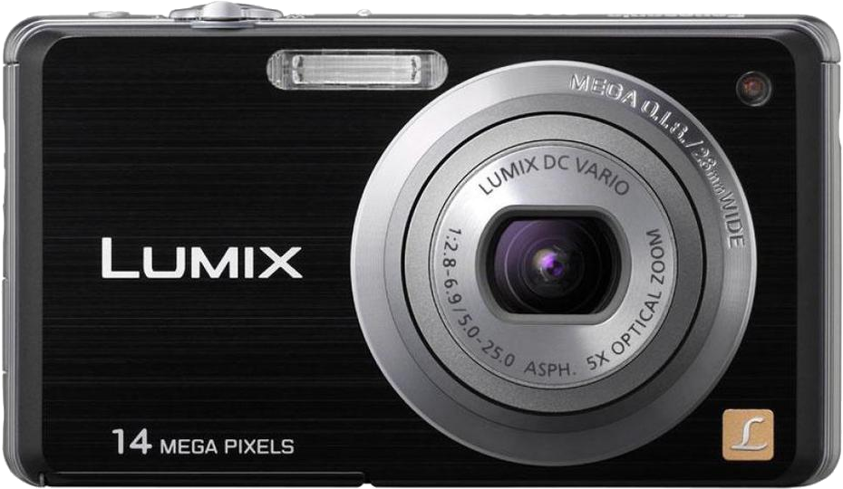

!!! info "Внимание, статья не завершена и информация в ней может изменяться по мере написания!"
!!! warning "Внимание! Фотографии в этой статье сняты в 4K и могут очень много весить, если у вас сильно ограничен интернет-траффик, не продолжайте просмотр!"
[{align=left width="256"}](lumix-dmc-fs11.md)
Фотоаппарат **Panasonic Lumix DMC-FS11** - это компактная камера с **14.10** мегапиксельной матрицей. Он обладает максимальным разрешением записи видео **1280x720** в **30** кадров в секунду. Фотоаппарат оснащён **2.70-дюймовым экраном**, который работает в режиме видоискателя и является фиксированным. Камера также оборудована оптическим зумом **5x** и оптическим стабилизатором изображения для фотосъемки (Работает ли он при съёмке видео - неизвестно). Этот фотоаппарат появился в моей семье примерно в 2011 году, перед поездкой в Крым. Использовался он очень часто и довольно долго, пока, место мыльниц не заняли смартфоны, как в моём случае с Xiaomi Redmi Note 4, но это совершенно другая история. А сейчас я пожалуй расскажу и покажу как же он всё таки фотографирует, и как он чувствует себя в 2024 году. Берите печеньки, заваривайте чаёк или что у вас там, и погнали!

<!-- more -->

## TODO...
!!! info "TODO"

Имеет съёмный литиевый перезаряжаемый аккумулятор и поддержку карт памяти **SDXC**. Объектив установленный в камере называется "*LUMIX DC VARIO*", его фокусное расстояние - **28-140 мм**, а диафрагма **F2.8-F6.9**. Тип матрицы - **CCD**, размер матрицы - **1/2.33"**, максимальное разрешение фото - **4320x3240**, светочувствительность **80-1600 ISO**, выдержка регулируется в пределах **60-1/1600 с**.