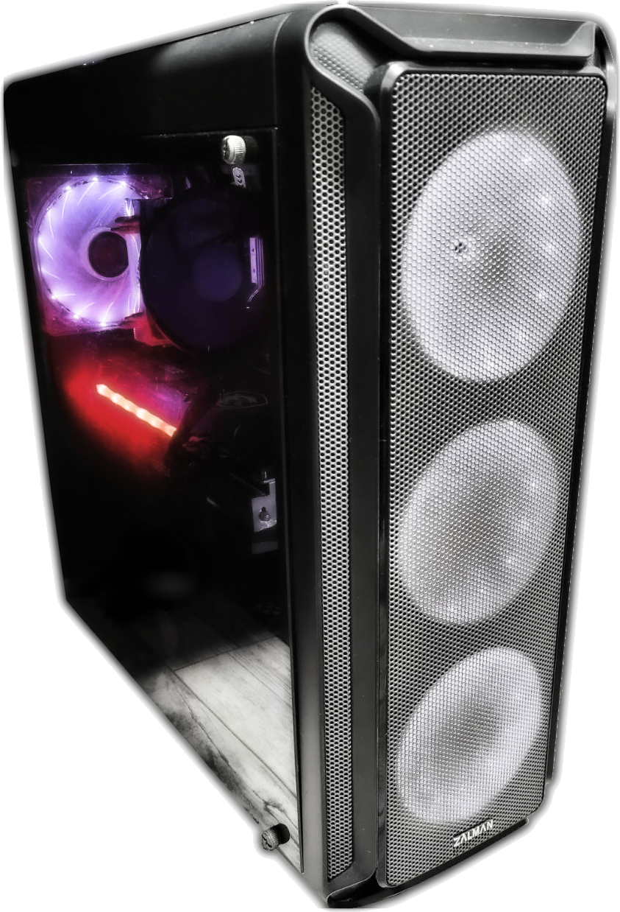

!!! info "Внимание, статья не завершена и информация в ней может изменяться по мере написания!"

[{align=left width="128"}](myPC.md)

*Краткое описание статьи не заполнено.*

     

<!-- more -->

## Всё началось с...
!!! info "TODO"

*Предыстория. Начало сборки компа. Первые комплектухи.*

## Железо (Комплектующие)
!!! info "TODO"

### Краткая таблица с железом

*ОС: Xubuntu 22.04 (Для работы) + Windows 10 Pro (Для игр)*

|                                       **CPU**                                       |                                                             **GPU**                                                             |                                                    **RAM**                                                    |        **Storage**        |                              **Motherboard**                              |                                       **PSU**                                       |
| :---------------------------------------------------------------------------------: | :-----------------------------------------------------------------------------------------------------------------------------: | :-----------------------------------------------------------------------------------------------------------: | :-----------------------: | :-----------------------------------------------------------------------: | :---------------------------------------------------------------------------------: |
| [AMD Ryzen 7 5700X 3.6 GHz ](https://www.amd.com/en/products/cpu/amd-ryzen-7-5700x) | [MSI GeForce RTX™ 3060 GAMING X TRIO 12G](https://www.msi.com/Graphics-Card/GeForce-RTX-3060-GAMING-X-TRIO-12G#FinAirflow-href) | [DDR4 GOODRAM IRDM PRO HOLLOW WHITE 16Gb x2](https://www.goodram.com/ru/products/irdm-pro-ddr4-hollow-white/) | 480GB SSD TEAM T253X5480G | [MSI MAG B550 TOMAHAWK](https://ru.msi.com/Motherboard/MAG-B550-TOMAHAWK) | [600W be quiet! Pure Power 11 (BN294)](https://www.bequiet.com/en/powersupply/1543) |
|                                                                                     |                                                                                                                                 |                                                                                                               |   1TB 2.5" HDD TOSHIBA    |                                                                           |                                                                                     |
|                                                                                     |                                                                                                                                 |                                                                                                               |  500 GB 3.5" HDD WD Blue  |                                                                           |                                                                                     |

## Paragraph 3
!!! info "TODO"