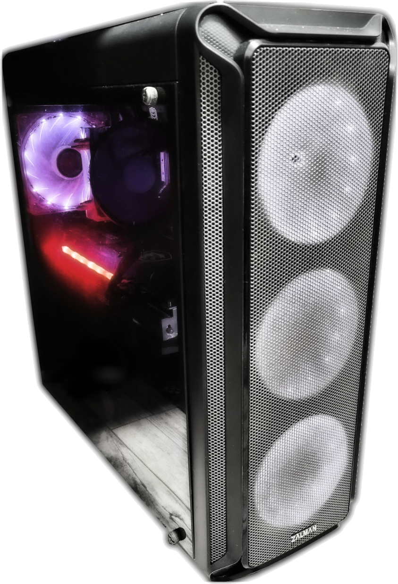

!!! info "Внимание, статья не завершена и информация в ней может изменяться по мере написания!"

[{align=left width="176"}](myPC.md)

*Краткое описание статьи не заполнено.*

     

<!-- more -->

## Всё началось с...
!!! info "TODO"

*Предыстория. Начало сборки компа. Первые комплектухи.*

## Железо (Комплектующие)
!!! info "TODO"

### Краткая таблица с железом

*ОС: Xubuntu 22.04 (Для работы) + Windows 10 Pro (Для игр)*

|     **CPU**     | [AMD Ryzen 7 5700X 3.6 GHz](https://www.amd.com/en/products/cpu/amd-ryzen-7-5700x) | | | |
| :-------------: | :-----------------------------------------------------------------------------------------------------------------------------: | :----------------------------------: | :-------------------------------------------------------------------------------: | :------------------------------: |
|     **GPU**     | [MSI GeForce RTX™ 3060 GAMING X TRIO 12G](https://www.msi.com/Graphics-Card/GeForce-RTX-3060-GAMING-X-TRIO-12G#FinAirflow-href) | | | |
|     **RAM**     | [DDR4 GOODRAM IRDM PRO HOLLOW WHITE 16Gb x2](https://www.goodram.com/ru/products/irdm-pro-ddr4-hollow-white/) | | | |
|     **SSD**     | 480GB SSD TEAM T253X5480G | 128GB NVMe SSD TEAM TM8FP6128G |
|     **HDD**     | 1TB 2.5" HDD TOSHIBA MQ01ABD1 | 500 GB 3.5" HDD WD Blue WD5000AAKX-0 | 1TB RAID0 (500 GB 2.5" HDD Seagate ST500LT012 + 500 GB 2.5" HDD TOSHIBA MQ01ABD0) | 500 GB 2.5" HDD TOSHIBA MK5076GS |
| **Motherboard** | [MSI MAG B550 TOMAHAWK](https://ru.msi.com/Motherboard/MAG-B550-TOMAHAWK) | | | |
|     **PSU**     | [600W be quiet! Pure Power 11 (BN294)](https://www.bequiet.com/en/powersupply/1543) | | | |

## Paragraph 3
!!! info "TODO"