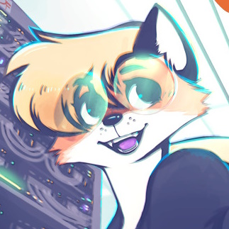
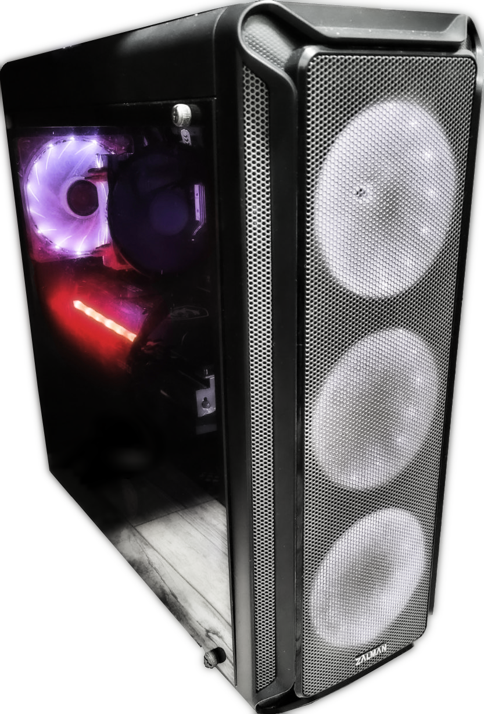
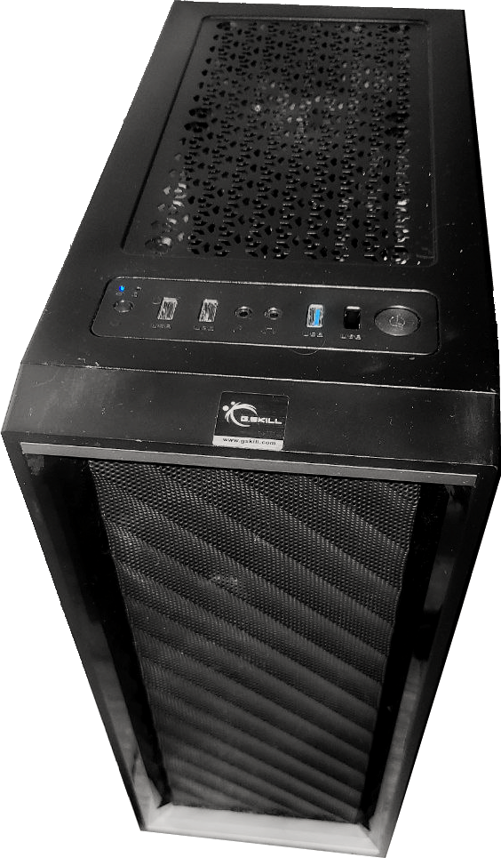

# Привет! Я IlyaBOT.

[{ align=right width="224"}](assets/IB_avatar.jpg "Моя текущая аватарка в соц. сетях")

Я обычный Донецкий парень, технарь, копающийся в горе радиодеталей и компьютерном железе, а так же не отказывающий себе в программировании. Пытаюсь худо-бедно в медийку, снимаю видео на [ютубчик](https://www.youtube.com/@ilyabot) и стримлю на [твиче](https://www.twitch.tv/ilya_boot). В свободное время отдыхаю в видеоиграх.

Мои увлечения:

- Компы и компьютерные железки. Мой технопарк можно посмотреть в разделе ["Моё оборудование"](myHardware/index.md)
- Радиолюбительство
- Linux. Люблю Linux. В пределах разумного.
- Системное администрирование
- Веб-дев?.. (*Почему-то мне нравится делать всякие сайты*🙂)
- Кодинг и любительское программирование (В основном микроконтроллеров или скриптов)
- Ну и куда же без _GAYming_'а.

Краткая информация обо мне:

| Имя  |     Д.Р.     |   Пол   |                        Гендер                         | Город  | Тип личности | Тип личности **MBTI** |
| :--: | :----------: | :-----: | :---------------------------------------------------: | :----: | :----------: | :-------------------: |
| Илья | 10 Июля 2006 | Мужской | _Предположительно гетеро_ :bootstrap-question-circle: | Донецк |   Технарь    |      **INTP-T**       |

## Мои взгляды на вещи и мировоззрение

- По возможности предпочитаю OpenSource ПО и сервисы и OpenHardware железки, при условии, что это **не вредит** моей деятельности и **качеству жизни** (Gentoo хорош, но нервные клетки мне дороже, спасибо).
- Даёшь ремонтопригодность в массы! #RightToRepair
- Q: _**AMD** или **Intel**? **AMD** или **nVidia**? **Samsung** или **Xiaomi**? **MSI** или **Asus**? **Linux** или **Windows**? **Левая** или **Правая** палочка Twix?_ 
  A: **Both. Both is good** :smirk: Несмотря на то, что у меня есть фаворитные бренды, при покупке чего-либо, бренд выбираю я по ситуации и обстоятельствам, а не только потому что это от любимого бренда. Но в приоритете всё же стоят: **AMD**, **nVidia**, **Samsung**, **MSI**, **Linux**, **обе ;)**.
- [_Амбивалентное_](https://ru.wikipedia.org/wiki/%D0%90%D0%BC%D0%B1%D0%B8%D0%B2%D0%B0%D0%BB%D0%B5%D0%BD%D1%82%D0%BD%D0%BE%D1%81%D1%82%D1%8C) отношение к Apple и Microsoft. _`(Некоторые действия компании мелкомягких я от части поддерживаю, например создание BingGPT, создание WSL (Иногда намного быстрее и легче запустить WSL, чем перезагружаться под Linux) и т.д., или как в случае с Apple всё ещё сложнее, в общем плане их сервисы и техника хороши и красивы (Apple были амбассадорами дизайна, но в последнее время начали скатываться в яму), у меня есть iPad 3 который пережил вздутый аккумулятор выдавивший матрицу и стекло и оказавшийся после замены аккумулятора полностью живым (В т.ч. и сенсор!), такой прочный планшет я увидел впервые. Asus ZenPad с похожей проблемой лежит у меня на полке требуя замену всего экранного модуля. Но некоторые действия этих компаний не выдерживают никакой критики, особенно DRM-тюрьма Apple и прориетарные стандарты)`_

## Мои основные девайсы

### [Мой компьютер](blog/posts/myPC/myPC.md)

Software: **_Xubuntu 22.04 (Основная) + Windows 10 Pro (Для некоторых игр и стримов)_** 
Hardware:

{ align=right width="256"}

|     **CPU**     | [AMD Ryzen 7 5700X 3.6 GHz](https://www.amd.com/en/products/cpu/amd-ryzen-7-5700x) | | | |
| :-------------: | :-----------------------------------------------------------------------------------------------------------------------------: | :----------------------------------: | :-------------------------------------------------------------------------------: | :------------------------------: |
|     **GPU**     | [MSI GeForce RTX™ 3060 GAMING X TRIO 12G](https://www.msi.com/Graphics-Card/GeForce-RTX-3060-GAMING-X-TRIO-12G#FinAirflow-href) | | | |
|     **RAM**     | [DDR4 GOODRAM IRDM PRO HOLLOW WHITE 16Gb x2](https://www.goodram.com/ru/products/irdm-pro-ddr4-hollow-white/) | | | |
|     **SSD**     | 480GB SSD TEAM T253X5480G | 128GB NVMe SSD TEAM TM8FP6128G |
|     **HDD**     | 1TB 2.5" HDD TOSHIBA MQ01ABD1 | 500 GB 3.5" HDD WD Blue WD5000AAKX-0 | 1TB RAID0 (500 GB 2.5" HDD Seagate ST500LT012 + 500 GB 2.5" HDD TOSHIBA MQ01ABD0) | 500 GB 2.5" HDD TOSHIBA MK5076GS |
| **Motherboard** | [MSI MAG B550 TOMAHAWK](https://ru.msi.com/Motherboard/MAG-B550-TOMAHAWK) | | | |
|     **PSU**     | [600W be quiet! Pure Power 11 (BN294)](https://www.bequiet.com/en/powersupply/1543) | | | |

---

### Моя периферия

|       Устройство        | Модель | Модель |
| :---: | :---: | :---: |
|  **Основной монитор**   | Asus VG249Q (FullHD 144Hz) | |
|   **Правый монитор**    | LG Flatron L1732S (1280x1024) | |
|     **Клавиатура**      | Kraftway KB-9810 (PS/2) | |
|        **Мышь**         | Defender Halo Z GM-430L | Wireless Optical Mouse MM-605 |
|        **Аудио**        | Наушники De-Tech купленные в далёком 2015. *Проапгрейжены новыми, более громкими и качественными динамиками.* |
|      **Микрофон**       | Fifine Ampligame A6V |
| **Графический планшет** | Genius G-Pen F350 |

---

### Мой сервер
{ align=right width="196"}
Некоторые мои сервисы держащиеся на этом сервере: [IlyaBOT.space](index.md), [IB-IFS](https://ibifs.ddns.net/), [IB-Craft](https://ibcraft.ru). 
Software: ***Ubuntu Server 22.04*** 
Hardware:

| **CPU** | **RAM** | **Storage** | **Mb.** | **PSU**  |
| :---: | :---: | :---: | :---: | :---: |
| [Intel(R) Xeon(R) CPU X3430 @ 2.4GHz](https://www.intel.com/content/www/us/en/products/sku/42929/intel-xeon-processor-x3430-8m-cache-2-40-ghz.html) | DDR3 KingSpec 8Gb | 120 GB SSD SmartBuy (OS) | [Asrock H55M-LE](https://www.asrock.com/mb/Intel/H55M-LE/) | FSP 400W |
| | DDR3 Patriot 8Gb | 120 GB SSD NoName (IB-Craft) | | |
| | | 960 GB SSD Goldenfir (HFS) | | |
| | | 500 GB SSD Patriot (Torrent+Backups) | | |

### Мой смартфон

Samsung Galaxy S20 FE 5G (**SM-G781B**) 
Software: **_Android 13, One UI 5.1_** 
Hardware:

[{ align=right width="384"}](assets/samsung-s20fe.png)

| **CPU** | **GPU** | **Memory** | **Screen** | **Front-cameras** | **Selfie-camera** |
| :---: | :---: | :---: | :---: | :---: | :---: |
| Qualcomm SM8250 Snapdragon 865 5G (7 nm+) | Adreno 650 | 1080 x 2400 pixels 6.5 inches Super AMOLED, 120Hz, HDR10+, **Always-on display** | 6/128 UFS 3.1 (RAM/ROM), microSDXC _(uses shared SIM slot)_ | 12 MP, f/1.8, 26mm (wide), 1/1.76", 1.8µm, Dual Pixel PDAF, OIS | 32 MP, f/2.2, 26mm (wide), 1/2.74", 0.8µm |
| | | | | 8 MP, f/2.4, 76mm (telephoto), 1/4.5", 1.0µm, PDAF, OIS, 3x optical zoom | |
| | | | | 12 MP, f/2.2, 13mm, 123˚ (ultrawide), 1/3.0", 1.12µm | |

P.S. _([Весь мой технопарк есть в разделе "Моё оборудование"](myHardware/index.md))_
