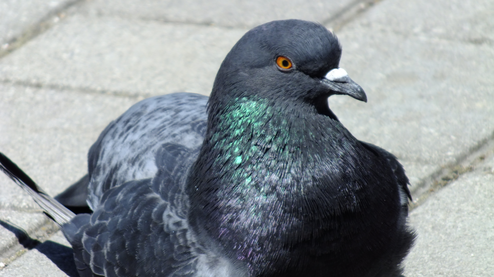

## Снято на: Fujifilm Finepix HS20EXR

Я ещё раз поехал в город, но в этот раз не в центр города (Золотое кольцо), а чуть дальше, на бульвар Пушкина. И снова я решил взять с собой свой фуджик и наделать кучу фотографий. Некоторые из них получились настолько хорошо, хоть на рабочий стол ставь!
И это даже несмотря на то, что фотографировал я их в режиме AUTO. Впрочем, у меня есть RAW-копии этих фотографий, может быть потом когда я научусь редактировать RAW-ки я смогу как-то улучшить эти фотографии.

Выровненная версия:

[{width="512"}](pics/DSCF0250.JPG)

[{width="512"}](pics/DSCF0263.JPG)

